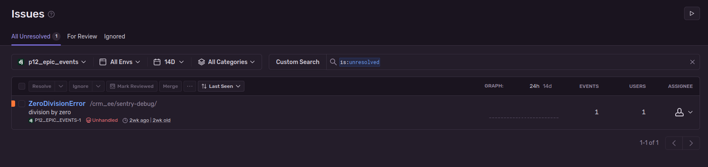

# CRM de EPIC Events #

1. [Description](#description)
2. [Diagramme ERD](#ERD_diagram)
3. [Sentry monitoring](#sentry)
4. [Installation et configuration](#install_config)
   1. [Prérequis](#prerequisite)
   2. [Installation du projet](#install_project) 
   3. [Configuration de PostgreSQL](#config_postgreSQL)
   4. [Configuration du projet](#config_project)
      1. [Droit admin et teams](#admin_team)
5. [Démarrer le serveur local](#runserver)
6. [Documentation Postman](#doc_postman)
7. [À propos](#a-propos)
   1.  [Bugs connus](#bugs-connus)


# Description <a name="description"></a> #

    Ce projet à été réalisé dans le cabdre du parcours 
    "Développeur d'application - Python" d'OpenClassrooms.

Ce CRM (Customer Relationship Management) permet le suivi de tous les clients et événements gérés par l'entreprise EPIC Events.

L'utilisation de ce CRM nécessite un compte (voir [Droit admin et comptes](#admin_user)).


# Diagramme ERD <a name="ERD_diagram"></a> #


# Sentry monitoring <a name="sentry"></a> #

Le projet est liable à votre compte Sentry (voir [Configuration du projet](#config_project))\
Après avoir installé et configuré le projet, vous pouvez vérifier que le compte est bien lié au projet sur :

```
localhost:8000/crm_ee/sentry-debug/
```
Cela doit générer une ZeroDivisionEror.




# Installation et configuration <a name="install_config"></a> #

### Prérequis <a name="prerequisite"></a> ###

- Python 3.10.6 (ddl [ici](https://www.python.org/downloads/release/python-3106/))
- PostgreSQL (ddl [ici](https://www.postgresql.org/ftp/source/v14.7/))


### Installation du projet <a name="install_project"></a> ###

0.  Depuis un terminal, rendez-vous à la racine du projet.
1.  Clonez ce dépôt à l'aide de la commande
    ```
    git clone https://github.com/geoffrey-ll/P12_GL_EPIC_Events .
    ```
    ou téléchargez-le [ici](https://github.com/geoffrey-ll/P12_GL_EPIC_Events/archive/refs/heads/master.zip)
2. Créez un environnement virtuel :
    - Sous Windows :
        ```
        python -m venv env
        ```
    - Sous macOS & Linux :
        ```
        python3 -m venv env
        ```
3. Activez l'environnement virtuel :
    - Sous Windows :
        ```    
        env\Scripts\activate
        ```
   - Sous macOS & Linux :
        ```
        source env/bin/activate
        ```
4.  Installez les dépendances du projet avec
    ```
    pip install -r requirements.txt
    ```


### Configuration de postgreSQL <a name="config_postgreSQL"></a> ###

1. Lancez un shell PostgreSQL
    ```
    sudo -u postgres psql
    ```
2. Créez une base de données :
    ```
    CREATE DATABASE 'DB name';
    ```
3. Créez un utilisateur sur cette base de données :
    ```
    CREATE USER 'DB username' WITH PASSWORD 'DB username password';
    ```
4. Accordez tous les droits à l'utilisateur sur la base de données :
    ```
    GRANT ALL PRIVILEGES ON DATABASE 'DB name' TO 'DB username';
    ```


### Configuration du projet <a name="config_project"></a> ###

1. À la racine du projet, créez un fichier ".env" contenant :
    ```
    SECRET_KEY="your secret key"
    DEBUG=True
    SENTRY_DSN="your URL DSN for sentry monitoring. Required sentry account. Is optionnel.
               https://sentry.io/signup/ for create a account."
   
    # Configuration DB postgreSQL
    DB_NAME="DB name"
    DB_USERNAME="DB username"
    DB_USERNAME_PASSWORD="DB username password"
    ```
2. Effectuez les migrations :
    ```
   python manage.py makemigrations
    ```
   puis
    ```
   python manage.py migarte
    ```
3. Créer un superuser :
    ```
    python manage.py createsuperuser
    ```
   avec pour team "WM"


##### Droit admin et teams <a name="admin_team"></a> #####

| team  | WM  | MA  | SA  | SU  |
|:-----:|:---:|:---:|:---:|:---:|
| admin | oui | oui | non | non |


### Démarrer le serveur local <a name="runserver"></a> ###

Une fois l'installation et les configurations faites.
1. Démarrez le serveur avec 
    ```
    python manage.py runserver
    ```


# Documentation Postman <a name="doc_postman"></a> #


La documentation Postman de l'API est à [cette adresse](https://documenter.getpostman.com/view/20658594/2s93JwM1t6)


# À propos <a name="a-propos"></a> #


## Bugs connus <a name="bugs-connus"></a> #


Aucun bug connu.
